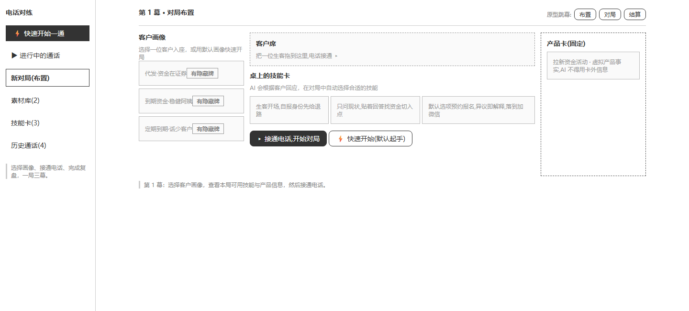
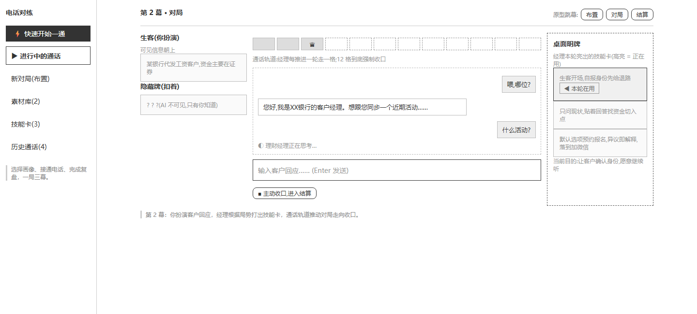

# 电话对练

一场为银行理财经理设计的 AI 电话策略游戏。

每一局，你会抽到一位带着明面信息和隐藏想法的客户。AI 理财经理带着从优秀通话中炼成的技能卡上桌，而你扮演客户，用真实反应考验它：这张开场卡能不能让人愿意听下去？需求探询会不会太急？客户拒绝时，它能不能体面收口？



> 低保真原型：客户画像入座后，技能卡与产品卡共同构成本局牌桌。

## 一局怎么玩

### 第 1 幕：布置牌桌

从客户画像中选择一位生客入座。画像里既有经理能够看到的背景，也有只有玩家知道的“隐藏牌”。桌上同时摆着已发布的**技能卡**和一张限定事实边界的产品卡。

### 第 2 幕：接通电话

你从客户视角回应，AI 理财经理根据对话局势自动打出技能卡。通话轨道记录对局进度，避免一通电话无休止地拖下去；该推进、该倾听还是该收口，都要在有限轮次里做选择。



### 第 3 幕：战后复盘

结算页不只给结果，还会翻开本局的策略路径：哪一轮用了哪张卡、它来自哪段优秀通话、对客户产生了什么影响。复盘之后，可以换一张画像再来一局。

## 你的牌库从哪里来

- **优秀录音是素材**：后台把录音整理成带说话人轮次的待校对稿。
- **真实经验变成技能卡**：从通话里提炼开场、探询、推进与收口等可复用动作。
- **人工决定什么可以上桌**：技能卡经过编辑和确认后才会发布，不让模型擅自改写团队方法。
- **每局都会留下战报**：技能卡与原始文字片段相连，方便回看和继续打磨。

它不是一套让人照念的标准答案，而是一个低成本试错的练习场：同一套能力，放到不同客户身上会发生什么，只有真正打一局才知道。

## 快速体验

```bash
npm install
npm run dev
```

打开 `http://localhost:5173`，点击“快速开始一通”，即可使用内置场景体验完整流程。未配置模型密钥时，项目会以**演示模式**运行：理财经理由内置脚本扮演，应答是固定的预设台词，仅用于走通流程与演示界面，不代表真实模型水平。

如需接入真实模型，请在仓库根目录创建 `.env.local`：

```env
MIMO_API_KEY=你的密钥
MIMO_BASE_URL=https://token-plan-cn.xiaomimimo.com/v1
MIMO_MODEL=mimo-v2.5
```

`MIMO_BASE_URL` 和 `MIMO_MODEL` 可以省略，系统会使用默认值。密钥只在本地服务端读取，不会发送到浏览器。配置密钥后，理财经理由真实模型扮演，会根据策略卡与你的对话动态应答。

## 导入优秀录音

录音转写放在后台运行，不会让前端对练停下来等待：

```bash
npm run audio:ingest -- "D:\path\call.m4a"
```

支持 `mp3`、`m4a`、`wav`、`webm` 和 `ogg`，单段不超过 25MB。系统会先转写录音，再整理经理与客户的发言轮次，生成一份待校对稿。

待校对稿默认保存在 Git 忽略的 `data/audio-intake/`。请先人工核对并完成脱敏，再交给素材库分析；录音和转写结果都不会自动发布。

## 开发与验证

| 命令 | 用途 |
| --- | --- |
| `npm run dev` | 启动网页与本地服务 |
| `npm test` | 运行测试 |
| `npm run typecheck` | 检查类型 |
| `npm run build` | 构建可部署版本 |
| `npm start` | 构建并启动单进程版本 |

项目仍在持续打磨中，当前重点是首次电话触达中的策略练习与复盘。它不用于替代合规审查、正式客户沟通或人工专业判断。
