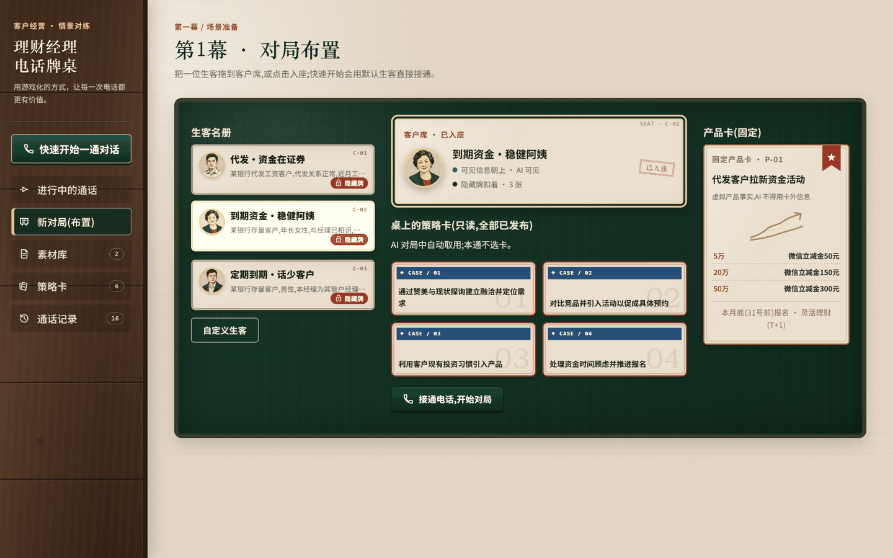
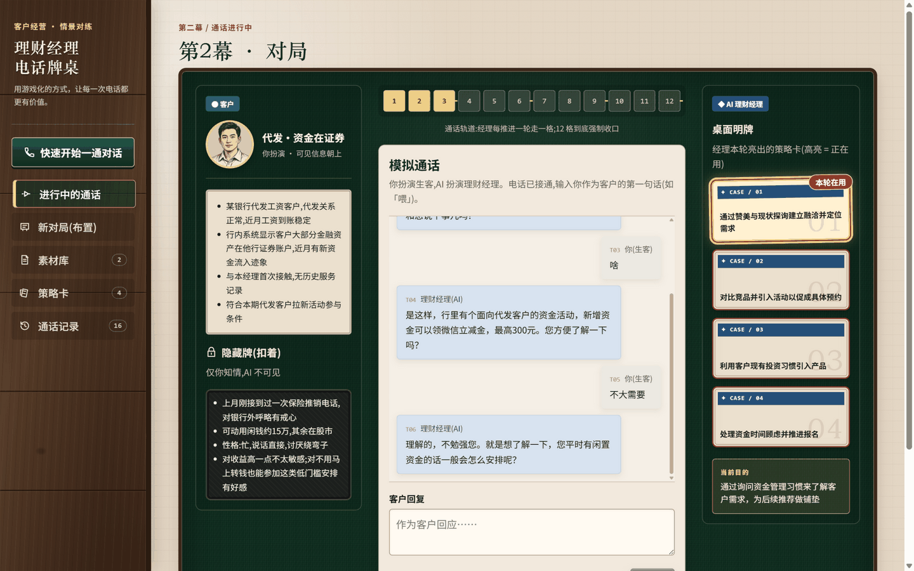
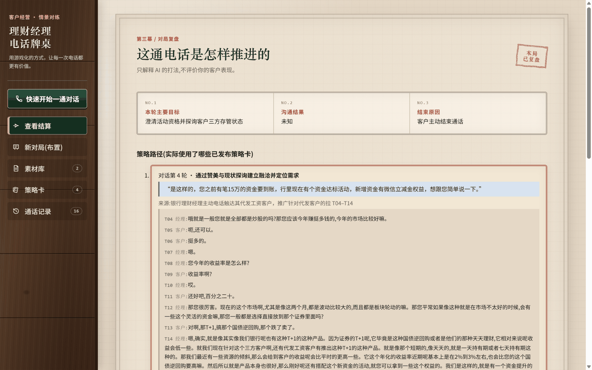
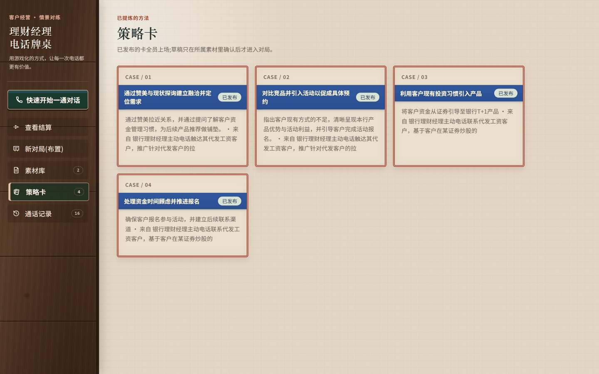
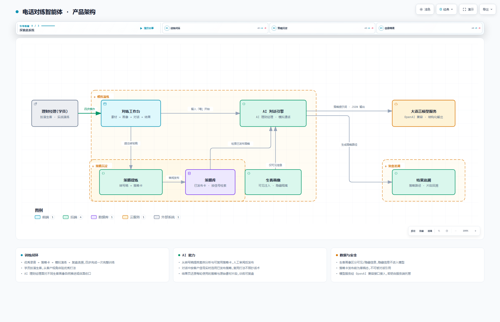

# Client Seat · 电话对练

一场为银行理财经理设计的 AI 电话策略游戏。

每一局，你会抽到一位带着明面信息和隐藏想法的客户。AI 理财经理带着从优秀通话中炼成的策略卡上桌，而你扮演客户，用真实反应考验它：这张开场卡能不能让人愿意听下去？需求探询会不会太急？客户拒绝时，它能不能体面收口？



> 当前实机界面：选择一位生客入座，全部已发布策略卡与通话逻辑卡共同构成本局牌桌。

## 一局怎么玩

### 第 1 幕：布置牌桌

从客户画像中选择一位生客入座。画像里既有经理能够看到的背景，也有只有玩家知道的“隐藏牌”。桌上同时摆着已发布的**策略卡**和一张**通话逻辑卡**——四条钱规律加本局参数。

### 第 2 幕：接通电话

你从客户视角回应，AI 理财经理根据对话局势自动打出策略卡。通话轨道记录对局进度，避免一通电话无休止地拖下去；该推进、该倾听还是该收口，都要在有限轮次里做选择。



### 第 3 幕：战后复盘

结算页不只给结果，还会逐轮翻开这通电话：客户当时说了什么、系统识别出什么信号、经理亮的是哪张卡、实际怎么回应、这张卡又来自哪段真实通话。匹配不上卡的轮次会如实标「未确认」，不硬凑。复盘之后，可以回到布置幕再来一局。



> 🎮 完整玩法以交互式 **[游戏手册](docs/game-manual.html)** 为准：开局准备 → 正式对局 → 结算复盘的流程图，标注了回合规则、隐藏信息隔离与「再来一局」循环，支持明暗主题与演示模式，用浏览器打开即可。

## 你的牌库从哪里来

策略卡不是人工凭空写的，也不是模型直接生成的——它从一段真实的优秀通话里**半自动提炼、人工确认**而来，共五步：

1. **录音进后台**:`npm run audio:ingest` 把优秀通话录音转写成按说话人分好轮次的文字稿(谁说的、第几句)，生成一份待校对稿。先人工核对说话人并脱敏，才会进入下一步。
2. **模型提炼素材**:转写稿交给素材库分析，模型输出结构化的案例分析(场景、客户状态、总目标、阶段拆解、可取与不可取之处)，并附 **1–3 张策略卡草稿**。每张卡自带:来源轮次区间(如 T04–T14)、触发信号、动作链、表达原则、参考话术和停止条件——卡和它出自的原话始终绑在一起。
3. **人工决定什么可以上桌**:在素材库里纠正说话人、修改分析和卡面，逐张确认发布。草稿永远进不了对局，模型无权替团队发布方法。
4. **对局中只认已发布卡**:AI 理财经理每一轮只看得到已发布的策略卡；它声称"本轮用了哪张卡"时，系统会校验这张卡确实在本轮的已发布集合内，对不上就不标注——策略引用不是模型说了算。
5. **复盘逐轮回溯**:结算页把每轮用卡与关键话术列成策略路径，"回放原文"一键跳回对应的原始通话片段；素材若被删除，复盘会如实标注"原始片段未能定位"。



它不是一套让人照念的标准答案，而是一个低成本试错的练习场：同一套能力，放到不同客户身上会发生什么，只有真正打一局才知道。

## 系统如何运转

整个产品是一条三段闭环：**策略沉淀**（优秀录音 → 案例分析 → 策略卡，人工审阅后发布）→ **模拟演练**（生客画像 + AI 对话引擎，AI 只引用已发布策略）→ **复盘追溯**（策略路径逐轮回溯到原始素材片段）。

两条贯穿全程的设计约束：画像中的隐藏信息对 AI 隔离，它只能靠对话把客户的真实情况挖出来；模型服务经 OpenAI 兼容接口接入，密钥只在本地服务端读取。



交互式 **[产品架构图](docs/architecture-external.html)** 覆盖同样的三段闭环，支持按「训练闭环 / 策略沉淀 / 信息隔离」三个视角切换查看。

## 快速体验

```bash
npm install
npm run dev
```

打开 `http://localhost:5173`，点击“快速开始一通”，即可使用内置场景体验完整流程。未配置模型密钥时，项目会以**演示模式**运行：理财经理由内置脚本扮演，应答是固定的预设台词，仅用于走通流程与演示界面，不代表真实模型水平。

如需接入真实模型，请在仓库根目录创建 `.env.local`：

```env
MIMO_API_KEY=你的密钥
MIMO_BASE_URL=https://token-plan-cn.xiaomimimo.com/v1
MIMO_MODEL=mimo-v2.5
# 转写(录音→文字)与对话共用同一供应商时,上面一组就够。
# 换转写供应商时,补下面一组(ASR 专用,纯音频转文字):
# ASR_API_KEY=...
# ASR_BASE_URL=...
# ASR_MODEL=mimo-v2.5-asr
```

`MIMO_BASE_URL` 和 `MIMO_MODEL` 可以省略，系统会使用默认值。密钥只在本地服务端读取，不会发送到浏览器。配置密钥后，理财经理由真实模型扮演，会根据策略卡与你的对话动态应答。

模型按角色分两组配置：**对话组**（`MIMO_*`：理财经理对话、素材文案分析、转写后的说话人整理）与**转写组**（`ASR_*`：录音转文字）。转写组未配置时自动复用对话组的密钥与地址，只换用转写模型；填上 `ASR_*` 三项即可把转写切换到另一家供应商。

## 对话存储上限

对话记录是唯一随使用无限增长的数据，为避免历史无限堆积，系统按保留策略自动清理旧对话（不区分进行中/已结束）：

- **最大存储时间**：对话创建超过保留期后清理，默认 **30 天**（`CONVERSATION_MAX_AGE_DAYS`）。
- **最大存储对话数**：存量对话超过条数上限时从最旧一端淘汰，默认 **200 通**（`CONVERSATION_MAX_COUNT`）。

两条规则取并集。清理在服务启动时和每次开新通话时执行，只作用于对话记录，素材/画像不受影响。在 `.env.local` 中调整：

```env
CONVERSATION_MAX_AGE_DAYS=30
CONVERSATION_MAX_COUNT=200
```

任一值设为 `0` 表示该维度不限制；填负数或小数会导致启动报错。

## 导入优秀录音

录音转写放在后台运行，不会让前端对练停下来等待：

```bash
npm run audio:ingest -- "D:\path\call.m4a"
```

支持 `mp3`、`m4a`、`wav`、`webm` 和 `ogg`，单段不超过 25MB。系统会先转写录音，再整理经理与客户的发言轮次，生成一份待校对稿。

待校对稿默认保存在 Git 忽略的 `data/audio-intake/`。请先人工核对并完成脱敏，再交给素材库分析；录音和转写结果都不会自动发布。

## 开发与验证

| 命令 | 用途 |
| --- | --- |
| `npm run dev` | 启动网页与本地服务 |
| `npm test` | 运行测试 |
| `npm run typecheck` | 检查类型 |
| `npm run build` | 构建可部署版本 |
| `npm start` | 构建并启动单进程版本 |

项目仍在持续打磨中，当前重点是首次电话触达中的策略练习与复盘。它不用于替代合规审查、正式客户沟通或人工专业判断。

## 项目文档

| 文档 | 内容 |
| --- | --- |
| [游戏手册](docs/game-manual.html) | 玩法流程图：开局准备 → 正式对局 → 结算复盘，含规则与回环（交互式，浏览器打开） |
| [产品架构](docs/architecture-external.html) | 对外展示用架构图：策略沉淀 → 模拟演练 → 复盘追溯，三个视角切换（交互式） |
| [组件图](docs/architecture.html) | 开发者视角的实现架构，组件可定位到源码文件（交互式） |
| [UI 素材库 v1](docs/design/ui-asset-library-v1.md) | 前端视觉方向：设计 token、组件规格与 AI 瑕疵更正，附概念图（拟物化改版的视觉基准） |
| [术语表](CONTEXT.md) | 素材、策略卡、收口等领域词汇的唯一定义 |
| [路线图](PROJECT-ROADMAP.md) | L0–L7 分层计划与当前进度 |

产品口径与任务明细见 `.scratch/phone-coaching-agent/`（`spec.md` 与 `issues/`）。
